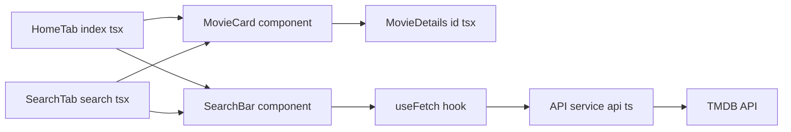
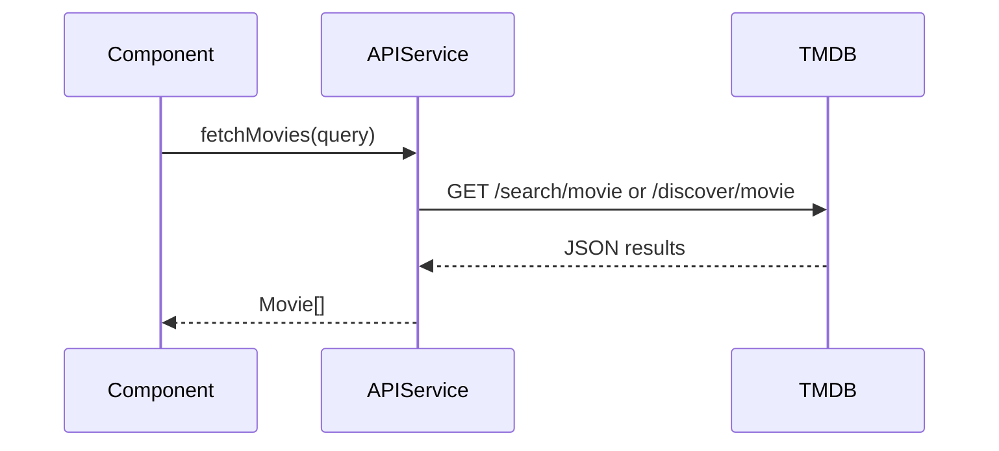
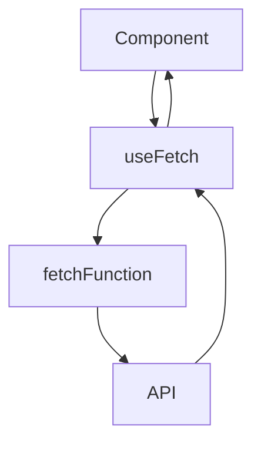

# MovieFlix App Documentation

An in-depth guide to the key files of the MovieFlix React Native application and their interplay.

## Architecture Overview

This diagram shows how pages, components, hooks, and services interact to fetch and display movie data.



# app/(tabs)/index.tsx

A **Home Tab** screen that fetches and lists the latest popular movies.

### Overview
This file renders the main tab of the app. It calls the TMDB API to retrieve popular movies and displays them in a grid.

### Responsibilities
- Automatically fetch movies on mount.
- Show loading indicator or error message.
- Render a search bar that navigates to the search tab.
- Display movies using a grid of `MovieCard` components.

### Dependencies
- `useFetch` hook for data fetching.
- `fetchMovies` service for API calls.
- `SearchBar`, `MovieCard` components.
- `icons` and `images` constants.
- `useRouter` from `expo-router`.

### Key Code Snippet
```js
const { data: movies, loading, error } = useFetch(
  () => fetchMovies({ query: '' })
);
...
<View className="flex-1 bg-primary">
  <Image source={images.bg} className="absolute w-full" />
  <ScrollView ...>
    <SearchBar
      onPress={() => router.push('/search')}
      placeholder="Search for a Movie"
    />
    <FlatList
      data={movies}
      renderItem={({ item }) => <MovieCard {...item} />}
      numColumns={3}
      keyExtractor={item => item.id.toString()}
    />
  </ScrollView>
</View>
```

# app/(tabs)/search.tsx

A **Search Tab** allowing users to search movies by title with debounce and trending count updates.

### Overview
This screen provides a text input for movie search. It performs debounced queries and logs usage counts.

### Responsibilities
- Manage `searchQuery` state.
- Debounce API calls on query change.
- Display loading spinner and error messages.
- List matching movies using `MovieCard`.

### Dependencies
- `useFetch` hook (manual fetch mode).
- `fetchMovies` service.
- `updateSearchCount` (tracks trending searches).
- `SearchBar`, `MovieCard` components.
- `icons`, `images` for branding.

### Key Code Snippet
```js
const { data: movies = [], loading, error, refetch, reset } =
  useFetch(() => fetchMovies({ query: searchQuery }), false);

useEffect(() => {
  const id = setTimeout(async () => {
    if (searchQuery.trim()) {
      await refetch();
      if (movies.length) {
        await updateSearchCount(searchQuery, movies[0]);
      }
    } else reset();
  }, 500);
  return () => clearTimeout(id);
}, [searchQuery]);
```

# app/(tabs)/saved.tsx

A **Saved Tab** placeholder for displaying user-saved movies.

### Overview
Currently renders static text. Intended to list movies the user has saved or favorited.

### Key Code Snippet
```js
export default function Saved() {
  return (
    <View>
      <Text>saved</Text>
    </View>
  );
}
```

# app/(tabs)/profile.tsx

A **Profile Tab** placeholder for user profile information.

### Overview
Renders static profile text. Future enhancements may include user settings and details.

### Key Code Snippet
```js
export default function Profile() {
  return (
    <View>
      <Text>profile</Text>
    </View>
  );
}
```

# app/movies/[id].tsx

A **Movie Details** dynamic route to display detailed info for a selected movie.

### Overview
Stub for the movie details page. Meant to fetch and render full details based on `id` route parameter.

### Key Code Snippet
```js
export default function MovieDetails() {
  return (
    <View>
      <Text>MovieDetails</Text>
    </View>
  );
}
```

# components/Button.tsx

A **custom button** component with consistent styling.

### Overview
Wraps `TouchableOpacity` and forwards a ref. Accepts all touch props and a `title`.

### Props
- `title: string` — Button label.
- All `TouchableOpacityProps`.

### Usage
```jsx
<Button title="Click me" onPress={handlePress} />
```

### Styling
- Rounded, indigo background.
- Shadow and padding.
- White, centered text.

# components/Container.tsx

A **SafeAreaView** wrapper to ensure content respects device safe areas.

### Overview
Provides consistent margin and flex styling for screen layouts.

### Usage
```jsx
<Container>
  {/* screen content */}
</Container>
```

### Styling
- `flex-1 m-6` for uniform spacing.

# components/EditScreenInfo.tsx

Displays **development hints** for editing the current screen.

### Overview
Shows the file path and instructions for hot-reload on code changes.

### Props
- `path: string` — File path to display.

### Usage
Often used inside `ScreenContent` to annotate screens.

# components/MovieCard.tsx

Renders a **movie poster card** in grid views.

### Overview
Displays poster image, title, rating stars, and release year. Wraps content in a navigable `Link`.

### Props (`Movie`)
- `id`, `poster_path`, `title`, `vote_average`, `release_date`.

### Usage
```jsx
<MovieCard
  id={movie.id}
  poster_path={movie.poster_path}
  title={movie.title}
  vote_average={movie.vote_average}
  release_date={movie.release_date}
/>
```

### Behavior
- Falls back to placeholder image if `poster_path` is missing.
- Rounds rating to a 5-star scale.
- Links to `/movies/id`.

# components/ScreenContent.tsx

A **template wrapper** for screens with title and code info.

### Overview
Centers content vertically and horizontally. Inserts a title, separator, and `EditScreenInfo`.

### Props
- `title: string`
- `path: string`
- `children?: React.ReactNode`

### Usage
```jsx
<ScreenContent title="Home" path="app/(tabs)/index.tsx">
  {/* custom JSX */}
</ScreenContent>
```

# components/SearchBar.tsx

A **search input** component with icon and styling.

### Overview
Shows a search icon and a `TextInput`. Supports placeholder and press handler.

### Props
- `placeholder: string`
- `onPress?: () => void`

### Usage
```jsx
<SearchBar
  placeholder="Search for movies"
  onPress={() => console.log('Pressed')}
/>
```

# constants/icons.ts

Exports key/value pairs of **icon assets**.

| Key    | Asset Path                          |
|--------|-------------------------------------|
| home   | `@/assets/icons/home.png`           |
| search | `@/assets/icons/search.png`         |
| person | `@/assets/icons/person.png`         |
| logo   | `@/assets/icons/logo.png`           |
| save   | `@/assets/icons/save.png`           |
| star   | `@/assets/icons/star.png`           |
| play   | `@/assets/icons/play.png`           |
| arrow  | `@/assets/icons/arrow.png`          |

# constants/images.ts

Exports key/value pairs of **background and decorative images**.

| Key             | Asset Path                             |
|-----------------|----------------------------------------|
| bg              | `@/assets/images/bg.png`               |
| highlight       | `@/assets/images/highlight.png`        |
| rankingGradient | `@/assets/images/rankingGradient.png`  |

# interfaces/interfaces.d.ts

TypeScript **interfaces** defining core data shapes.

- **Movie**: Basic movie info returned by TMDB.
- **TrendingMovie**: Tracks search term, count, and poster URL.
- **MovieDetails**: Full details including collections, companies, etc.
- **TrendingCardProps**: Props for a trending search card (`movie`, `index`).

# services/api.ts

Service functions for interacting with **The Movie Database API**.

### TMDB_CONFIG
```js
export const TMDB_CONFIG = {
  BASE_URL: "https://api.themoviedb.org/3",
  API_KEY: process.env.EXPO_PUBLIC_MOVIE_API_KEY,
  headers: {
    accept: "application/json",
    Authorization: `Bearer ${process.env.EXPO_PUBLIC_MOVIE_API_KEY}`,
  },
};
```

### fetchMovies
- Accepts `{ query: string }`.
- If `query` non-empty, calls `/search/movie`; else `/discover/movie`.
- Returns `Promise<Movie[]>`.
- Throws on non-OK response.

### fetchMovieDetails
- Accepts a `movieId` string.
- Calls `/movie/{movieId}` endpoint.
- Returns `Promise<MovieDetails>`.

#### Sequence Diagram


# services/usefetch.ts

A **custom React hook** to streamline async data fetching.

### Signature
```ts
function useFetch<T>(
  fetchFunction: () => Promise<T>,
  autoFetch?: boolean
): {
  data: T | null;
  loading: boolean;
  error: Error | null;
  refetch: () => Promise<void>;
  reset: () => void;
};
```

### Behavior
- Manages `data`, `loading`, `error` state.
- Calls `fetchFunction` on mount if `autoFetch` is `true`.
- Exposes `refetch` and `reset`.

#### Data Flow


# types/images.d.ts

Enables importing `.png` files as modules in TypeScript.

```ts
declare module "*.png" {
  const content: any;
  export default content;
}
```

# app.json

Expo configuration file defining app metadata and platform settings.

```json
{
  "expo": {
    "name": "MovieFlix",
    "slug": "MovieFlix",
    "version": "1.0.0",
    "scheme": "movie",
    "platforms": ["ios", "android"],
    "plugins": ["expo-router"],
    "experiments": { "typedRoutes": true, "tsconfigPaths": true },
    "orientation": "portrait",
    "icon": "./assets/images/logo.png",
    "splash": { "image": "./assets/images/logo.png" },
    "assetBundlePatterns": ["**/*"]
  }
}
```

# package.json

Defines project scripts, dependencies, and tooling for **MovieFlix**.

```json
{
  "name": "movie",
  "version": "1.0.0",
  "main": "expo-router/entry",
  "scripts": {
    "start": "expo start",
    "android": "expo start --android",
    "ios": "expo start --ios",
    "lint": "eslint \"**/*.{js,ts,tsx}\" && prettier -c",
    "format": "eslint --fix && prettier --write"
  },
  "dependencies": {
    "expo": "^54.0.0",
    "expo-router": "~6.0.17",
    "react": "19.1.0",
    "react-native": "0.81.5",
    "nativewind": "latest",
    "@expo/vector-icons": "^15.0.2"
  },
  "devDependencies": {
    "typescript": "~5.9.2",
    "eslint": "^9.25.1",
    "prettier": "^3.2.5",
    "prettier-plugin-tailwindcss": "^0.5.11"
  }
}
```
